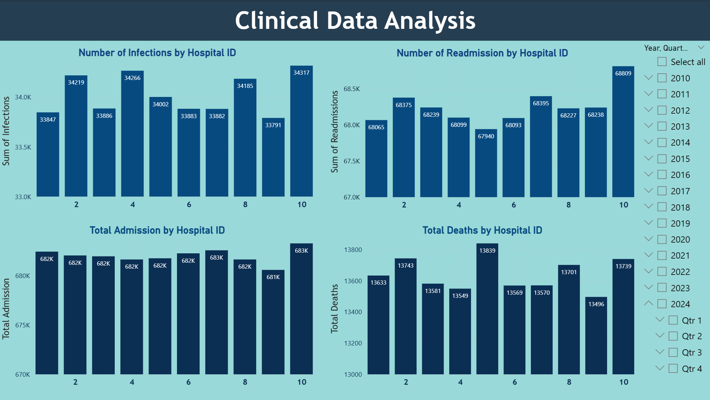
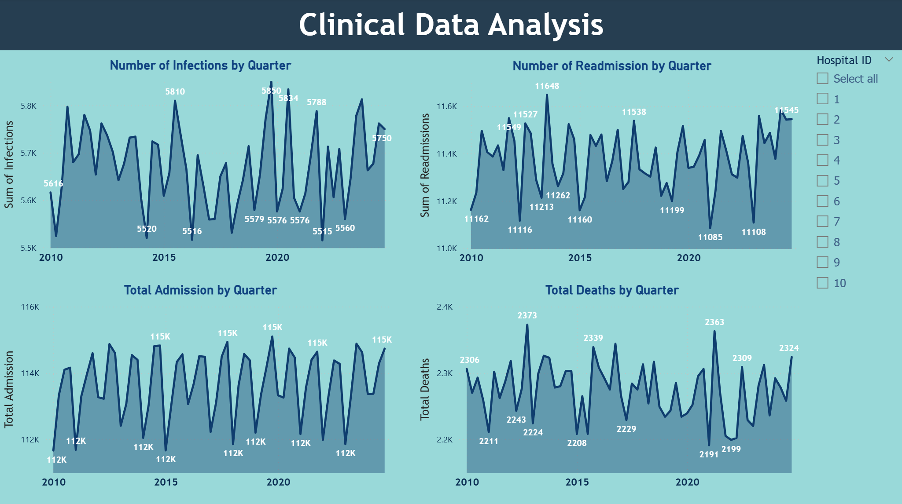

# Clinical Data Simulation & Power BI Dashboard

## Overview
This project simulates **patient-level healthcare data** (~6.8 million records) and aggregates it into hospital-level daily summaries. The data is stored in **SQL Server** and visualized in **Power BI**.

## Workflow
1. **Data Simulation**
   - Generate patient-level records across 10 hospitals (2010–2024).
   - Each record includes: HospitalID, AdmissionDate, LengthOfStay, IsReadmission, HasInfection, DiedInHospital.

2. **Aggregation in SQL**
   - Use SQL queries to calculate daily hospital summaries:
     - `HospitalID`
     - `AdmissionDate`
     - `TotalAdmissions`
     - `Readmissions`
     - `Infections`
     - `TotalDeaths`
     - `AverageLengthOfStay`

3. **Power BI Connection**
   - Connect SQL Server tables to Power BI.
   - Build interactive dashboards for hospital performance analysis.

## Dashboard Features
### 1. Bar Charts
- Number of Infections by HospitalID  
- Number of Readmissions by HospitalID  
- Total Admissions by HospitalID  
- Total Deaths by HospitalID  

### 2. Time Lines
- Number of Infections by Quarter  
- Number of Readmissions by Quarter  
- Total Admissions by Quarter  
- Total Deaths by Quarter  

### 3. Statistics
- Set up drillthrough statistic detail
- Max, Min, Mean, Median, and Standard Deviation for:
  - TotalAdmissions  
  - Readmissions  
  - Infections  
  - TotalDeaths  

## Purpose
This project demonstrates how to:
- Simulate large-scale healthcare datasets.
- Aggregate patient-level data into hospital-level metrics using SQL.
- Visualize trends and statistics in Power BI for decision support.

